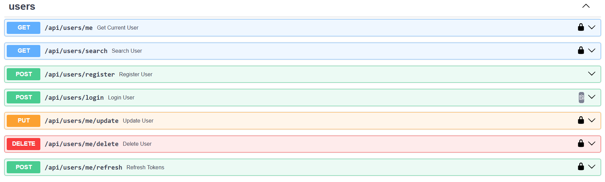
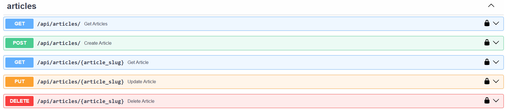
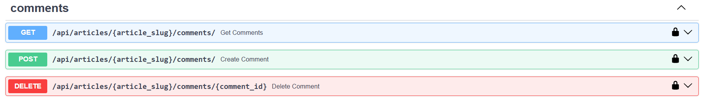

# RESTful Blog API

## Описание

Это приложение содержит RESTful API на языке Python с применением библиотеки FastAPI. С помощью API блога можно совершать различные операции над его содержимым - над пользователями, статьями и комментариями. Все операции храняться в базе данных PostgreSQL. Ниже приведен перечень того, к каким эндпоинтам можно обращаться:

1. Проверка работоспособности приложения
   

2. CRUD операции над пользователями. Обновление и получение пользователя доступно после авторизации и получения access токена.

   

3. CRUD операции над статьями. Только авторизованный пользователь может с ними взаимодействовать.

   

4. CRUD операции над комментариями. Доступ к комментариям осуществляется только для созданных статей и в случае авторизации пользователя.

   

## Требования для запуска

- Python >=3.10
- Poetry для управления зависимостями
- PostgreSQL (локально или в контейнере Docker)
- Docker и Docker Compose (опционально, для удобного запуска)

## Запуск приложения

1. Клонируйте репозиторий:

```bash
git clone https://github.com/portlexs/microservice-architecture
```

2. Скопируйте переменные окружения в файл `.env` из файла `.env.example` и измените их при необходимости.

3. Запустите сборку Docker образа:

```bash
docker compose -p blog --profile default up --build
```

4. Переходите по ссылке http://localhost:8000/docs
