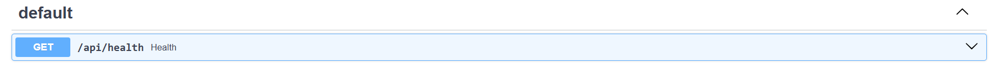
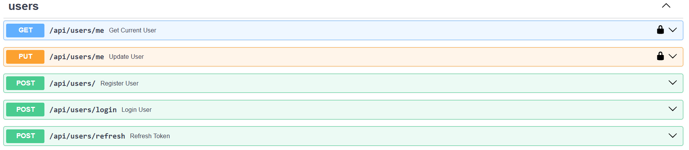
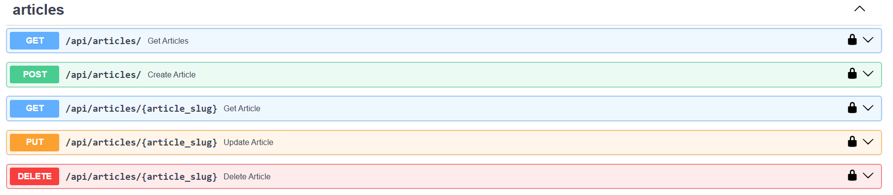
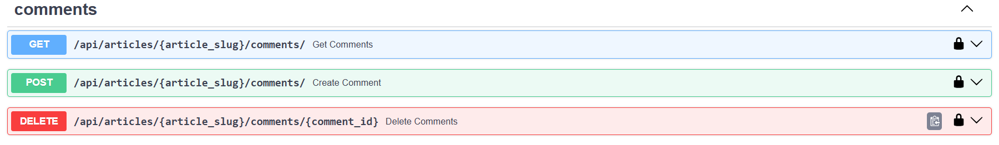

# RESTful Blog API

## Описание

Это приложение содержит RESTful API на языке Python с применением библиотеки FastAPI. С помощью API блога можно совершать различные операции над его содержимым - над пользователями, статьями и комментариями. Все операции храняться в базе данных PostgreSQL. Ниже приведен перечень того, к каким эндпоинтам можно обращаться:

1. Проверка работоспособности приложения

   

2. CRUD операции над пользователями. Обновление и получение пользователя доступно после авторизации и получения access токена.

   

3. CRUD операции над статьями. Только авторизованный пользователь может с ними взаимодействовать.

   

4. CRUD операции над комментариями. Доступ к комментариям осуществляется только для созданных статей и в случае авторизации пользователя.

   

[...](Ссылка на развернутое приложение)

## Требования для запуска

- Python >=3.10
- Poetry для управления зависимостями
- PostgreSQL (локально или в контейнере Docker)
- Docker и Docker Compose (опционально, для удобного запуска)

## Быстрый запуск приложения

1. Клонируйте репозиторий:

```bash
git clone https://github.com/portlexs/microservice-architecture
```

2. Запустите сборку Docker образа:

```bash
docker compose --profile default up --build -d
```

3. Обновите зависимости Alembic:

```bash
docker exec -it blog_api sh
cd app/
alembic upgrade head
```

4. Переходите по ссылке http://localhost:8000/docs

## Локальный запуск приложения

1. Клонируйте репозиторий:

```bash
git clone https://github.com/portlexs/microservice-architecture
```

2. Установите зависимости через Poetry:

```bash
poetry install
```

3. Обновите зависимости Alembic:

```bash
cd app/
alembic upgrade head
```

4. Настрйте переменные окружения. Пример переменных окружения представлен в файле `.env.example`.

5. Запустите образ базы данных:

```bash
docker compose --profile dev up --build -d
```

(или создайте базу данных локально в `pgAdmin`/`psql`)

6. Запустите приложение:

```bash
python main.py # в папке app/
```

7. Переходите по ссылке http://localhost:8000/docs

## Тестирование

Для запуска тестов необходимо запустить следующую команду:

```
pytest tests/
```
